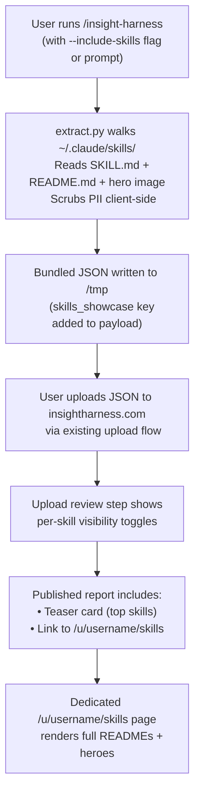

# Skill Showcase Integration for Insight Harness

## Problem Frame

Insight Harness reports currently show skills only as keyword-inferred labels (e.g., "uses custom skills," "uses worktrees") detected from transcript text via `src/lib/skill-detector.ts`. This is lossy — it can't distinguish someone who mentioned worktrees from someone who built a sophisticated worktree-management skill with a full README.

The insight-harness collection skill (`~/.claude/skills/insight-harness/scripts/extract.py`) already walks `~/.claude/skills/` and plugin directories to read SKILL.md frontmatter. It enumerates every skill by name, description, allowed-tools, and source (user/plugin/command). But it never reads the README.md or hero images.

Users who share their Insight Harness report should be able to also share the skills they've built as a discoverable portfolio. The primary audience is **fellow Claude Code users** looking to discover and adopt new skills — a "steal my setup" use case. This turns the report from a usage summary into a practical resource.

## User Flow

## Requirements

**Data Collection (extract.py)**

- R1. Extend `extract_skill_inventory()` to optionally read `README.md` from each skill directory alongside the existing SKILL.md frontmatter.
- R2. Optionally read `assets/hero.png` or `assets/hero.jpg` from each skill directory and encode as base64 in the output payload. Reject images larger than 500KB (before base64 encoding) — log a warning and skip. Only PNG and JPEG are accepted; SVG is excluded (XSS risk via embedded scripts).
- R3. Filter out any skills with `repo: private` or `repo: none` in SKILL.md frontmatter (per R5). For remaining skills, bundle README content and hero base64 under a `skills_showcase` key in the harness JSON output. Each entry includes: name, description, source (user/plugin:name/command), category (from SKILL.md `category:` frontmatter, nullable), readme_markdown, hero_base64 (nullable), allowed_tools, user_invocable, and calls (invocation count from session data, default 0).
- R4. Apply PII scrubbing to README content before it leaves the user's machine. Use the same replacement rules as skill-showcase: git username in URLs → `<your-username>`, home dir paths → `~/`, git name/email → placeholders. The scrub runs on raw markdown text, not rendered HTML.
- R5. Skills with `repo: private` or `repo: none` in SKILL.md frontmatter are excluded from the showcase payload entirely — they are never extracted.
- R6. The showcase data collection is opt-in via a `--include-skills` flag on the extract command. Users who don't pass the flag get the same payload as today.

**Upload & Review (insightharness.com)**

- R7. The existing upload flow parses the `skills_showcase` key from harnessData if present. No upload-step changes needed for the data to reach the server — it rides inside the existing JSON blob.
- R8. The upload review step shows a per-skill visibility toggle when `skills_showcase` data is present. Each skill can be individually hidden or shown before publishing.
- R9. Hidden skills are excluded from both the teaser card on the report page and the full skills page. The visibility state is stored alongside the existing `hiddenHarnessSections` pattern (or a parallel `hiddenSkills` array on the report).
- R10. Hiding a skill in any context (showcase, skill card summary, etc.) hides it everywhere — the visibility is a single source of truth per skill per report.

**Report Rendering — Teaser Card**

- R11. Add a "Skills" summary card to the report page at `/insights/[slug]`. Shows the top 3-5 skills by invocation count from the `calls` field in skills_showcase data (or all if fewer than 5), each with name and one-line tagline from SKILL.md description. Skills with zero invocations are sorted alphabetically after invoked skills.
- R12. The teaser card includes a "View all skills →" link to the dedicated skills page.
- R13. The teaser card shows both custom and plugin skills, with visual distinction (badge or color).
- R14. The teaser card respects the same collapsible/toggleable pattern as other harness sections.

**Report Rendering — Dedicated Skills Page**

- R15. Create a new route at `/u/[username]/skills` that renders the full skill showcase from the user's most recent report containing skills_showcase data.
- R16. Each skill section shows: name, custom/plugin badge, one-line tagline, hero image (if present), and rendered README body (markdown → HTML). Markdown rendering must use a sanitizing pipeline (e.g., `react-markdown` with `rehype-sanitize`) that strips raw HTML/scripts from user-supplied content. External links open in new tab with `rel="noopener"`. This prevents stored XSS from malicious or careless README content.
- R17. Skills are grouped by category when available. Categories come from the `category:` frontmatter field in SKILL.md. Skills without a category go in an "Other" group. No inference from README content — explicit frontmatter only. If no skills have categories, the page renders a flat list (no TOC).
- R18. The page includes a table of contents with category headings and skill entries.
- R19. The page is responsive — usable at 375px mobile and comfortable at 1400px desktop.
- R20. Hero images render from base64 data URIs stored in harnessData. No external image hosting required for v1.

**Empty States**

- R23. If `skills_showcase` is absent from harnessData (user didn't pass `--include-skills`), do not render the teaser card or the "View all skills" link. The `/u/[username]/skills` route returns a "No skills published yet" page (not 404).
- R24. If all skills are hidden via per-skill toggles, suppress the teaser card. The skills page shows a "No visible skills" message.
- R25. On new upload: per-skill visibility resets to all-visible. Users must re-apply hide preferences each upload. (Simplest model — no cross-report state to manage.)

**API & Privacy**

- R21. The `GET /api/insights/[slug]` endpoint must respect skill visibility — hidden skills are stripped from the response, including their README content and hero base64. This follows the same pattern as `stripHiddenHarnessData()` in `src/lib/harness-section-visibility.ts`.
- R22. PII scrubbing happens client-side only (in extract.py). The server stores and serves whatever was uploaded. No server-side scrubbing.

## Success Criteria

- A user who runs the insight-harness skill with showcase enabled and uploads to insightharness.com sees their skill READMEs rendered on a public page linked from their report.
- A visitor to the report can browse skills, read READMEs, and see hero images without leaving insightharness.com.
- Skills marked `repo: private` in SKILL.md never appear in the uploaded data or on any page.
- Skills hidden during the upload review step are excluded from all views and the API response.
- No PII (git name, email, home path, GitHub username) appears in rendered skill content on the public page.

## Scope Boundaries

- **Not building a standalone skill showcase page** — the showcase is part of the Insight Harness report, not a separate product.
- **Not adding object storage in v1** — hero images stored as base64 in harnessData JSON. Migrate to Supabase Storage or similar later if payload size becomes a problem.
- **Not adding cross-user skill search or discovery in v1** — skills are per-report. A "browse all shared skills" feature could come later but is out of scope.
- **Not modifying the skill-showcase standalone skill** — that remains a separate local-only tool. This feature reuses its PII-scrubbing logic but renders through Insight Harness's React components.
- **Not adding skill README editing on the server** — content is read-only once uploaded. Users edit READMEs locally and re-upload.

## Key Decisions

- **Both custom and plugin skills included**, with badges — the audience wants the full toolkit picture for discovery.
- **Heroes as base64 in JSON for v1** — avoids new infrastructure. Per-image cap of 500KB (before base64), PNG/JPEG only, no SVG. Measured locally: 1 hero at 368KB across ~20 skills. Realistic worst-case with the cap: 20 heroes × 500KB × 1.33 (base64 overhead) = ~13MB — still under Postgres JSONB limits but may bump against the 10MB upload cap. Raise upload cap to 25MB or compress further if needed.
- **PII scrubbing client-side only** — PII never leaves the user's machine. Server is a passthrough. This aligns with the existing privacy promise in the insight-harness skill.
- **Per-skill visibility toggle** — cascading single source of truth, consistent with hiddenHarnessSections pattern.
- **Teaser + full page** — summary card on report for at-a-glance, dedicated page for the full showcase.
- **Opt-in via `--include-skills` flag** — showcase data is not extracted by default. Single explicit flag, no config files or prompts.
- **Category from SKILL.md frontmatter only** — no inference from README content. Explicit `category:` field or "Other". Flat list when no categories exist.
- **XSS prevention** — markdown rendered through a sanitizing pipeline (react-markdown + rehype-sanitize). No raw HTML from user READMEs reaches the DOM.
- **Visibility resets on re-upload** — per-skill hide preferences don't carry across reports. Simplest model, no cross-report state.

## Dependencies / Assumptions

- The insight-harness extraction script (`extract.py`) is the sole collection point. Changes happen there, not in the upload page or a separate tool.
- The `harnessData Json?` column in Prisma can accommodate the additional ~3MB of base64-encoded hero images without performance issues. (Postgres JSONB limit is effectively ~1GB per value.)
- A markdown-to-HTML renderer is needed: `react-markdown` with `remark-gfm` and `rehype-sanitize`. Not currently in the project's package.json — must be added.
- Server-side PII scrubbing is explicitly deferred. Client-side scrubbing in extract.py is the v1 approach. A server-side defense-in-depth pass can be added later without architecture changes.

## Outstanding Questions

### Deferred to Planning

- [Affects R4][Technical] Port the PII scrubbing logic from `skills/skill-showcase/scripts/build-showcase.js` (JavaScript) to `extract.py` (Python). Define the ruleset as a shared spec (pattern + replacement pairs) and validate with the existing self-test fixtures.
- [Affects R8][Technical] Determine the exact UI pattern for per-skill toggles in the upload review step. Audit how the existing `hiddenHarnessSections` toggles are implemented for consistency.
- [Affects R9][Technical] Per-skill visibility needs a schema anchor. Either add `hiddenSkills String[] @default([])` to InsightReport (Prisma migration) or store visibility inside the `skills_showcase` JSON. Planner must decide.
- [Affects R21][Technical] The existing GET /api/insights/[slug] handler does not call `stripHiddenHarnessData`. This must be added for both section-level and per-skill stripping to work.

## Next Steps

→ `/ce:plan` for structured implementation planning
