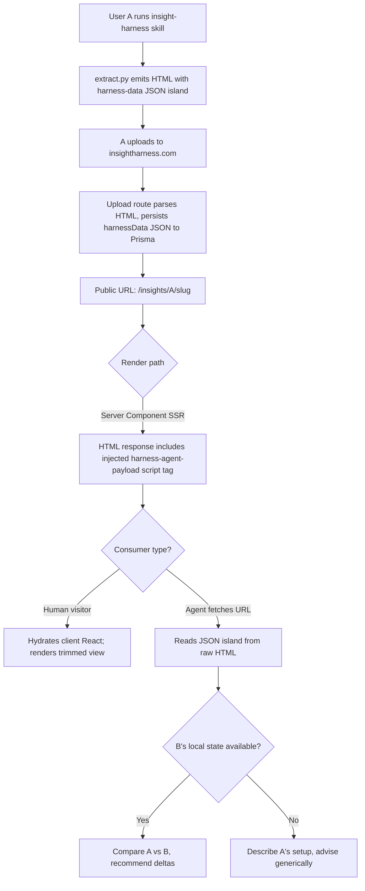

# Agent-Consumable Harness Report

## Problem Frame

Today the Insightful harness report is a single human-shaped page. It works for self-reflection ("what does my own setup look like?") and casual third-party browsing, but it's not an effective input for _another agent_ trying to help its user learn from someone else's workflow.

The desired behavior: user A publishes their report at a stable URL. User B says to their Claude Code or Codex agent, "look at A's harness and tell me what I could learn or copy." B's agent fetches the URL, parses a structured payload, compares A's setup to B's local harness state, and returns prose advice ("A uses skill X heavily; you don't have it — here's how to install it"). Same agent should also be able to answer descriptive questions about A's habits without B's local state.

**This is a positioning shift, not just a feature.** Today Insightful's primary artifact is the human page; this brainstorm bets a meaningful share of value moves to the agent payload, and the human view becomes a curated front door rather than the canonical artifact. Three adjacent product ideas in memory (Harness Battle, Cowork Pages, Shareable Harness Skill) point at different bets; this brainstorm picks "infrastructure for peer-learning agents" as the lane. We do not commit to that bet permanently — the Phase 0 prototype below exists to test it before a contract gets locked in.

## Architecture (verified)

Two facts that reshape the work:

1. The published URL `/insights/[username]/[slug]` is currently a `"use client"` React component (`src/app/insights/[username]/[slug]/page.tsx`). It rebuilds the report from a Prisma `InsightReport.harnessData` JSON column via `/api/insights/...`. The original uploaded HTML is parsed at upload time (`src/app/api/upload/route.ts` via cheerio) and **discarded** — there is no `htmlBlob`. A naive `curl` of the URL returns a Next.js client shell, not user A's harness HTML.

2. `extract.py` already emits a JSON island today: ``. It is parsed by `src/lib/harness-parser.ts:parseHarnessHtml` at upload time. Most of what an agent payload needs is already structured: `skillInventory`, `hookDefinitions`, `hookFrequency`, `plugins`, `mcpServers`, `cliTools`, `models`, `permissionModes`, `workflowData`, `agentDispatch`, `perModelTokens`, etc.

These together mean the work is **not** "create an agent payload from scratch." It is "extend the existing harness-data JSON, then re-emit it on the published page via Next.js SSR." The renderer change is the load-bearing piece, not the upload pipeline.

## User Flow

## Phase 0 — Reference Consumer (prerequisite)

Before locking the schema in Phase 1, ship a throwaway consumer that exercises the **existing** `harness-data` JSON island. Goals:

- Validate that an LLM agent can produce useful, specific advice from the current data shape (with whatever curation we add).
- Surface what fields are missing, redundant, or wrong-shaped _before_ committing them to a public contract.
- Test whether typical user-B prompts are pattern-shaped ("what does A's daily flow look like?") or diff-shaped ("what does A have that I don't?") — the schema should be optimized for whichever wins.

Form: a 30–60 line script (Python or a single skill prompt) that fetches a published report URL, extracts the JSON island, and prompts Claude with: "Tell user B what they could learn from this person's harness." Run on 3–5 real published reports. Capture failure modes in a planning note.

This is **scoped in**, not deferred. Without it, every field choice in R3–R6 below is a guess.

## Requirements

**Agent Payload — extending the existing JSON island**

- R1. The published page emits a `<script type="application/json" id="harness-agent-payload">` block at server-render time, derived from the existing `harnessData` JSON column. The legacy `id="harness-data"` tag is preserved (or aliased) for the upload-side parser; `harness-agent-payload` is the new public contract for external consumers. The two MAY be the same content during a transitional period.
- R2. The payload contains a top-level `schema_version` field (string, semver). v1 ships as a single structured JSON object; the curated/appendix split is _deferred_ until Phase 0 reveals which fields the consumer actually depends on.
- R3. The payload schema is shaped by Phase 0 findings, not by guesswork. Phase 1 freezes only the fields Phase 0 demonstrably needed; everything else stays "best-effort, may change in future versions". This frozen-vs-best-effort distinction is **documentation-only in v1** — there is no in-payload marker that distinguishes the two; consumers learn from the published schema doc, not from the JSON shape.
- R4. Per skill, the payload includes (minimum): name, frontmatter `description`, scrubbed `README` excerpt, invocation count (raw — consumers compute rank), and a structured install pointer in the form `{kind: "plugin" | "curl" | "local", owner?, repo?, skill?, command?}` rather than a free-text URL. The structured form lets consumers rebuild the install command without parsing prose, and is compatible with the privacy posture in R12.
- R5. Per hook, the payload includes: event, matcher, command (with both project-name and OS-username scrubbing — see R11), and fire frequency.
- R6. Plugins, MCP servers, permissions, and workflow phase / tool-transition stats are included. MCP server names are classified before publication: known-public servers (Airtable, Gmail, GitHub, Linear, etc.) pass through; unrecognized names are replaced with `<custom-mcp-N>` (see R12).
- R7. The payload header includes `schema_version` and `source_extract_version`. Generation timestamp is recoverable from the report's published creation time and is not duplicated in the header.

**Distribution & Architecture**

- R15. One canonical URL per published report. The Next.js page server-injects the JSON island into its rendered HTML.
- R16. Discovery is via the stable element ID `harness-agent-payload`. No separate `<meta>` tag, no sibling `.json` endpoint, no `?format=agent`. R1's element ID is sufficient discoverability for v1.
- R17. The JSON island is in the served HTML (no JavaScript execution required to read it). This requires the report page to render server-side (Server Component or route handler) — verifying that the existing `"use client"` page can be converted, or split, is part of planning.

**Privacy, Threat Model & Scrubbing**

- R11. The agent payload uses the same PII scrub as the rendered human view. Anything not safe enough for the JSON is not safe enough for the page either.
- R12. **Privacy posture for plugin/repo identifiers:** the existing scrubber rewrites `github.com/<owner>/...` URLs and detected owner strings. The agent payload ships **structured install pointers** (R4's `{kind, owner, repo, ...}` triples). The `owner` and `repo` fields are populated under three rules, in order:
  1. **Plugin-installed skills** — skills whose source is `plugin:<owner>/<repo>:<skill>` (already published via a public marketplace) auto-populate `owner`/`repo` from the plugin slug. They are public by construction; the user's act of installing from a public marketplace is the opt-in.
  2. **User-authored skills with `repo: public`** — populate `owner`/`repo` from the frontmatter.
  3. **Everything else** (user-authored with `repo:` unset, or any other ambiguous case) — `owner`/`repo` left null; the structured pointer ships only `{kind, skill?}`. Consumer agents see "this skill exists" but not "where to install it from."
  - `repo: private` and `repo: none` continue to exclude the skill entirely (existing extract.py behavior).
  - Free-text occurrences of owner strings in descriptions and READMEs continue to be scrubbed by the existing rules.
  - Net effect: usernames appear in install pointers only when (a) the user already published via a public marketplace, or (b) the user explicitly marked the skill `repo: public`. Default is privacy-safe.
- R13. Hook commands are scrubbed for OS-username paths (existing rule), GitHub-owner URLs (existing rule), and project-name tokens derived from the local repo's directory name. Hook commands containing any unrecognized binary path or any token matching a heuristic for "looks like a secret" are emitted as `<event>: <redacted>` rather than partially scrubbed. The heuristic errs toward over-redaction: false negatives (a real secret slips through to a public URL) are unacceptable; false positives (an innocuous token gets redacted) are acceptable degradation.
- R14. The payload includes a small `_privacy` block listing the _categories_ of scrubbing applied (e.g., `["identity", "paths", "marketplace_owners", "project_names"]`) and a `policy_version` string. This is descriptive — it tells consumers what category of scrubbing was applied so they can reason about provenance, but does NOT enumerate the specific rules or fields touched (which would help an attacker target unscrubbed surfaces).

**Threat Model**

The payload is publicly fetchable user-controlled data consumed by other users' LLM agents. Three threat classes shape requirements:

| Threat                                                                                                                                                                                                                           | Mitigation / Acceptance                                                                                                                                                                                                                                                                                                                     |
| -------------------------------------------------------------------------------------------------------------------------------------------------------------------------------------------------------------------------------- | ------------------------------------------------------------------------------------------------------------------------------------------------------------------------------------------------------------------------------------------------------------------------------------------------------------------------------------------- |
| **Combinatorial fingerprinting** — even with direct identifiers stripped, the union of skill names, MCP servers, plugin set, and hook patterns is a strong identity fingerprint a sufficiently capable consumer can re-identify. | **Accept** as a documented residual risk surfaced in the user-facing publish flow. The user has already chosen to publish; the marginal exposure from structuring the same data is small. Future opt-in for finer-grained redaction is a Phase 2 question.                                                                                  |
| **Scrapers / training crawlers / archival** — the same payload is fetchable by anyone, not just user-B's agent.                                                                                                                  | **Accept** for v1; add `<meta name="robots" content="noai, noimageai">` and a `robots.txt` disallow on the report path to signal intent. Surface the implication ("your structured profile will be machine-readable by anyone, including LLM training scrapers") at upload time.                                                            |
| **Prompt-injection-as-data** — A is the data author; B's agent is the consumer. Free-text fields (READMEs, descriptions, hook commands) can contain instructions designed to manipulate B's agent.                               | Mitigate at the consumer layer: free-text fields are namespaced under `_untrusted_text` (or a per-field marker) so consumer prompts can tell the LLM to treat them as quoted data, not instructions. Install commands and structured pointers must be presented to user B for approval — the consumer never auto-executes from the payload. |

**Human View Trimming** _(independent workstream — may ship separately)_

These requirements describe an adjacent UX cleanup that has no causal dependency on the agent payload. Bundled here for context; can be split into a separate brainstorm if the agent payload work is paced differently.

- R8. The human-view sections are trimmed so a third-party visitor can grasp the report in roughly 60 seconds. The principle is "what would a peer skim-read?" Specific trimming requires a named visitor and JTBD — see Resolve Before Planning.
- R9. No data category is removed entirely from the page; trimming means moving lower-signal detail into collapsed/expandable sections, secondary tabs, or the agent JSON only — not deleting it. The default tier is "collapsed-on-page"; "agent JSON only" is reserved for data with no skim value to a third-party human (e.g., minute-granularity token totals, full per-tool transition matrices).
- R10. Token totals, raw counts, and cross-cutting distributions stay accessible but do not dominate the priority view. Priority view is defined as the first ~900px on a 1440-wide desktop and the first ~700px on a 390-wide mobile.

## Success Criteria

- **Phase 0:** The reference consumer, given 3–5 real published report URLs, produces advice that meets all three of these criteria for at least 3 of the 5 reports:
  - **(a) Concreteness:** advice cites at least one specific skill, hook, plugin, or workflow pattern from A's harness by name, not generic categories.
  - **(b) Actionability:** advice names a concrete action user B could take (install command, hook config snippet, pattern to try) — not just "consider doing X."
  - **(c) Forward-test:** the judge would forward this advice to a peer trying to learn from this person's setup.
  - The corpus **must include at least 1 report authored by someone other than the brainstorm author**, to control for self-judgment bias. For non-author reports, the brainstorm author plays user B and judges whether the advice surfaces a concrete delta they would act on. For author's-own reports, only criteria (a) and (b) apply (the (c) forward-test degenerates).
  - Failure modes are documented and shape Phase 1.
- **Phase 1 schema:** A consumer agent (the Phase 0 prototype or a successor) round-trips through the payload without falling back to scraping the rendered HTML. Schema validation passes against a checked-in JSON Schema fixture in both repos.
- **Privacy:** Adversarial scrub pass — feed the published payload to a fresh Claude with the prompt "who is the author of this harness?" The author's GitHub username should not appear in the output unless it appears via a structured install pointer the user explicitly opted into.
- **Human view (if R8–R10 ship):** The trimmed report answers the named visitor's top-3 questions within the priority view at both breakpoints, and total page scroll height drops by ≥30% vs the current `/insights/[username]/[slug]`.

## Scope Boundaries

- **In scope:** Phase 0 reference consumer, Phase 1 payload extension and SSR injection, the privacy/scrub extensions in R11–R14.
- **Not in scope:** A production consumer agent skill (the Phase 0 prototype is throwaway). B-side state inspection. Auth-gated agent endpoints. Changing the upload pipeline or slug generation.
- **Optional / separable:** Human view trim (R8–R10) — may ship as its own PR before, after, or instead of the agent payload work.

## Key Decisions

- **Extend the existing JSON island, don't build a parallel one.** `extract.py` already emits `harness-data`. The agent payload aliases or supersedes it; we don't ship two contracts.
- **SSR injection on the Next.js page is the load-bearing change.** The upload pipeline already produces structured data; the renderer is what makes the JSON island appear at the published URL.
- **Phase 0 before schema lock-in.** A throwaway consumer validates field choices before they become a public contract.
- **Structured install pointers, not bare URLs.** Resolves the R12/R13 contradiction by shipping `{kind, owner, repo}` triples that the existing scrubber's URL-rewrite rule doesn't fight; consumers reconstruct install commands.
- **Single JSON object in v1, not curated+appendix.** The split is premature without a consumer to anchor it; revisit in v2.
- **Descriptive `_privacy` block, not prescriptive.** Tell consumers what categories were scrubbed, not which fields or rules.
- **Threat model documented, not engineered around.** Combinatorial fingerprinting and crawler exposure are accepted with disclosure; prompt-injection-as-data is mitigated at the consumer layer.

## Dependencies / Assumptions

- Verified: `extract.py` produces structured data; the published page rebuilds from `harnessData`; an `id="harness-data"` JSON island already ships.
- _Unverified — Phase 0 spike_: the Next.js page can be converted to a Server Component (or split into one) without breaking the existing client interactions. If the conversion is non-trivial, the fallback is a sibling route handler that emits the same HTML with the JSON island injected.
- _Unverified — Phase 0 spike_: a `<script type="application/json">` tag survives the SSR + hydration round-trip without being stripped or mutated. Must be confirmed before Phase 1 lands.

## Outstanding Questions

### Resolve Before Planning

- [Affects R8–R10][User decision] **Visitor persona and JTBD** for the human-view trim — who is the third-party visitor, what are their top-3 questions, and what's their desired exit (click into a project, copy a skill install, follow the author, leave)? Without this, "what to trim" is unanswerable. Skip if the trim is split out as a separate brainstorm.
- [Affects R3–R6][User decision] **Phase 0 reference consumer scope** — Python script vs Claude Code skill vs ad-hoc prompt? And which 3–5 published reports are the test corpus (must include ≥1 non-author report per Success Criteria)?
- [Affects R15, R17][Architectural] **Server Component fallback compatibility.** R16 forbids "sibling endpoints"; the unverified fallback in Dependencies is a "sibling route handler that emits the same HTML." If the SSR conversion fails, does a route handler at the same canonical URL satisfy R15/R16, or does it count as a forbidden sibling? Resolve before Phase 0 so the fallback isn't a hidden requirements conflict.
- [Affects R1][Technical] **Two-id transition policy.** R1 keeps `harness-data` alongside the new `harness-agent-payload`. Pick one of: (i) `harness-data` becomes strictly upload-side and is never emitted on the public page (only `harness-agent-payload` is public); (ii) both ids carry literally identical content via a single source-of-truth serialization, with a CI equivalence test. Set a deprecation date for the legacy id either way.
- [Affects scope][Strategic] **Production-consumer commitment.** Phase 0 prototype is throwaway and the production consumer is "out of scope." Either commit a Phase 2 owner/timeline for a real consumer, or state the trigger that would cause us to build one ("if no third-party consumer ships within 8 weeks of Phase 1 release, we own building a Claude Code skill").

### Deferred to Planning

- [Affects R1, R15, R17][Technical] How is the published page converted to (or wrapped by) a Server Component to inject the JSON island? Read `src/app/insights/[username]/[slug]/page.tsx` and `src/app/insights/[username]/[slug]/layout.tsx` to scope.
- [Affects R2, R7][Technical] Where does the JSON Schema for the payload live? Options: (i) a JSON Schema file checked into both `kabirdos/insight-harness` and `insightful` (manual sync); (ii) a tiny shared package; (iii) generated TS types + Python dataclasses from a single source. Pick during planning.
- [Affects R2, R7][Technical] Header field placement — is `schema_version` a top-level field (and `header` is loose terminology) or a nested `header` object? Pick one for the JSON Schema.
- [Affects R12][Technical] **`repo: public` migration.** The field does not exist in `extract.py:parse_skill_frontmatter` today. Add it as an optional frontmatter value (default behavior unchanged: only `private`/`none` are recognized; `public` is the new opt-in). No mass migration of existing skills required because R12 rule 1 (plugin-installed skills) already covers most install pointers via the `plugin:<owner>/<repo>:<skill>` source.
- [Affects R6, R12][Technical] Allowlist for "known-public" MCP servers — which names pass through verbatim?
- [Affects R13][Technical] What's the implementation for the "looks like a secret" heuristic? Likely net-new code (no existing rule in `pii_scrub.py`); candidates include token-prefix matching (`sk-`, `ghp_`, `AKIA`), entropy threshold, length heuristics. Err toward over-redaction per R13.
- [Affects R14][Technical] `policy_version` lifecycle — when the policy advances due to a security-relevant change, are existing reports re-rendered against the new policy on next render, or backfilled by a one-time job? Reports must not be served with a `policy_version` known to have a security defect.
- [Affects Threat Model row 3][Technical] `_untrusted_text` namespacing is advisory unless consumers know about it. Either include a top-level `consumer_guidance` string in the payload that instructs LLM consumers how to treat `_untrusted_text` fields, or downgrade the threat-model language from "mitigate" to "partial mitigation requiring consumer cooperation."
- [Affects Threat Model row 1, R12][UX] Disclosure copy at upload time — what does it say, where is it placed, and is it repeated on re-publish? The fingerprinting risk needs disclosure that names re-identification in plain terms ("the combination of your skills, plugins, and MCP servers may be unique enough to identify you even with usernames removed").
- [Affects R2, R3][Technical] Schema-version mismatch behavior — when a consumer agent encounters a `schema_version` newer or older than expected, does it fail loud, fall back to scraping, or downgrade-and-warn? Phase 0 should surface the answer.

## Next Steps

→ Phase 0 prototype before `/ce:plan`. Once Phase 0 produces failure-mode notes, then `/ce:plan` for structured implementation planning of Phase 1.
