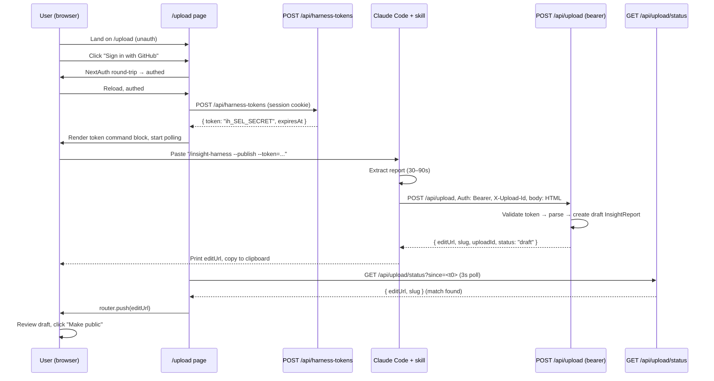

# Tokenized Direct-POST Upload

**Target repos:**

- **Primary:** `insightful` (this repo) — schema, API, upload page
- **Secondary:** `insight-harness` (sibling clone at `../insight-harness` when running the skill units) — skill CLI + SKILL.md. Units marked `[insight-harness]` target that repo; all other paths are repo-relative to `insightful`.

## Overview

Replace the multi-step "copy install commands → run skill → hunt for HTML file → drag into upload UI → sign in → wizard → publish" flow with a three-action first-time experience (sign in, copy, paste) and a one-action repeat experience (`/insight-harness`). The skill authenticates via a server-minted bearer token and POSTs the report directly to `/api/upload`. Reports land as drafts, invisible to the public until the owner clicks "Make public" on the edit page. The existing drag-drop flow survives as a fallback.

## Problem Frame

See origin: `docs/brainstorms/2026-04-22-tokenized-direct-post-requirements.md`. Current flow has friction at five points; a polish pass would sand edges but discards work when direct-POST lands. Low usage is the cheapest moment to rebuild — no installed base to migrate.

## Requirements Trace

All requirements below map to the origin document. Covered by implementation units in the section below.

**Token lifecycle:** R1, R2, R3, R4, R5 (removed), R26 → Units 4, 5, 6, 9
**Bearer auth on upload:** R6, R7, R8 → Units 1, 5, 7
**Draft visibility:** R9, R9a, R9b, R10, R11 → Units 1, 2, 3, 10
**Rate limits + idempotency:** R12, R13, R14, R14a → Units 5, 7
**Skill integration:** R15–R21 → Units 11, 12
**Upload page:** R22, R23, R24, R25 → Unit 9

## Scope Boundaries

Carried from origin. Reinforced during planning:

- Existing multipart drag-drop flow at `POST /api/upload` stays unchanged; bearer-auth path is additive.
- No changes to `/insights/<username>/<slug>/edit` beyond the new "Make public" action and a non-owner 404 guard for drafts (Unit 3, 10).
- No Redis / Upstash — verified absent. Rate limiting and idempotency are Postgres-backed.
- Auth provider stays GitHub-only (NextAuth v5, JWT strategy, no Prisma adapter).
- Windows clipboard support in skill: deferred (macOS + Linux only).
- Retry logic in skill: out of scope. User re-runs manually.

## Context & Research

### Relevant Code and Patterns

**Schema & migrations**

- `prisma/schema.prisma` — `InsightReport` model (lines 34–88). No `isDraft`, no token models today. Unique: `@@unique([authorId, slug])`.
- `prisma/migrations/` — two naming styles coexist; standardize on `20260422_<slug>/migration.sql`. Deploy is run by CI (`prisma migrate deploy`); **never reset** the migration history (see `agent/MEMORY.md` baseline note).

**Auth**

- `src/lib/auth.ts` — NextAuth v5 export surface: `{ auth, handlers, signIn, signOut }`. Session shape: `session.user = { id, username, name?, email?, image? }`.
- `src/lib/auth-utils.ts` — `getCurrentUser()` helper.
- `src/lib/auth.config.ts` — edge config; `/upload` already blocked for logged-out users via the `authorized` callback (lines 22–24). This means R22's "unauth sees sign-in CTA" requires relaxing that rule.
- **Pattern for authed handler** (mirror `src/app/api/insights/route.ts:262–270`): `auth()` → 401 if no `session?.user?.id`, then `prisma.user.findUnique({ where: { id: session.user.id } })`.

**Read paths that must filter drafts (R9a)** — all 13 sites surfaced by research:

- `src/app/api/insights/route.ts:135, 159` (feed list + count)
- `src/app/api/insights/[username]/[slug]/route.ts:41, 167, 191, 228, 241` (GET, PUT guards, update, DELETE guard, delete)
- `src/app/api/insights/[username]/[slug]/vote/route.ts:37, 95`
- `src/app/api/insights/[username]/[slug]/highlight/route.ts:37, 90`
- `src/app/api/insights/[username]/[slug]/comments/route.ts:12, 88`
- `src/app/api/insights/[username]/[slug]/annotations/route.ts:28`
- `src/app/api/insights/[username]/[slug]/projects/route.ts:28`
- `src/app/api/insights/[username]/[slug]/projects/[projectId]/route.ts:28`
- `src/app/api/og/[username]/[slug]/route.tsx:139` (OG image)
- `src/app/api/leaderboard/route.ts:43`
- `src/app/api/top/route.ts:73` (via `buildWhereClause` at line 22)
- `src/app/api/search/route.ts:32`
- `src/app/insights/[username]/[slug]/layout.tsx:13` (page metadata)
- `src/app/api/users/me/setup-suggestions/route.ts:43` — owner-scoped; exempt (verify during implementation).

**Canonical URL helpers** — `src/lib/urls.ts`:

- `buildReportUrl(username, slug)` → `/insights/{username}/{slug}`
- `buildReportEditUrl(username, slug)` → `/insights/{username}/{slug}/edit`
- All edit-URL strings in the plan use these helpers, not hard-coded paths.

**Upload page** — `src/app/upload/page.tsx` (2416 lines):

- Step wizard: `type Step = "upload" | "projects" | "review"` (line 58)
- `handlePublish` (lines 704–833) — the code path that currently runs on publish; contains the section-map snake→camel transform (line 753), title autogen, projectIds, redaction application. This logic must move server-side for the bearer-auth path (Unit 7).
- Steps 2–3 (`projects`, `review`) are reused on the post-publish edit page — nothing new to build there (origin scope boundary confirmed).

**Skill** — `../insight-harness/skills/insight-harness/scripts/extract.py`:

- `VERSION = "2.7.0"` (line 67), `main()` at 2895, entry point at 3107.
- CLI parsing: hand-rolled `sys.argv` (lines 2899, 2906). Add `argparse` for the new flags (Unit 11).
- Output (lines 3059–3101): writes dated HTML + stable `report.html` + optional macOS `Documents/Claude Reports/` copy. Final line: `print(str(dated_path))` — this is the contract `SKILL.md` documents.
- No existing config.json. Introduce `~/.claude/insight-harness/config.json` with `0600` perms.

**Testing**

- Vitest 3.2.4; colocated `__tests__/`; invoke via `npx vitest`.
- API route test pattern: mock `@/lib/db` with per-model `vi.fn()` stubs; mock `@/lib/auth` with `auth: vi.fn()`; `wireTransaction()` helper for `$transaction` callbacks. See `src/app/api/insights/__tests__/route.test.ts`.
- Upload test pattern: fixture-driven at `src/app/api/upload/__tests__/route.test.ts`.

### Institutional Learnings

- `docs/solutions/` does not exist in this repo; no prior learnings found.
- `agent/MEMORY.md` (2026-04-13) — Prisma migration history was baselined; the `_prisma_migrations` table exists and CI runs `prisma migrate deploy`. **Hard constraint: never reset.** All new migrations must be purely additive.

### External References

No external research performed — the relevant patterns (selector+secret tokens, draft visibility, Postgres-backed rate limits, idempotency headers) are well-established and the codebase already has enough adjacent patterns (route handlers, Prisma mocks, NextAuth wrappers) to mirror.

## Key Technical Decisions

1. **`isDraft` is a new boolean column on `InsightReport`, defaulting to `false`.** Rejected alternative: making `publishedAt` nullable and treating null as draft. Rejected because `publishedAt` is already set on every existing row (backfilling would be more work than adding a new column), and `isDraft` is unambiguous for human readers.
2. **Token format: `ih_<12 hex selector><64 hex secret>` — fixed-position, delimiter-free after `ih_`.** Total length: 3 + 12 + 64 = 79 chars. Selector is 6 random bytes (48 bits) as lowercase hex; secret is 32 random bytes (256 bits) as lowercase hex. Parsing: strip the `ih_` prefix, take the first 12 chars as selector, the remaining 64 as secret. **Do not use `base64url` here** — its alphabet contains `_` and would make any delimiter-based split ambiguous. Hex is unambiguous and URL/log-safe. Server stores selector indexed + `hashedSecret` (bcrypt, cost factor 10). Auth is O(1): look up by selector → bcrypt-compare the secret. Rationale: matches GitHub PAT shape (prefix + opaque blob); the delimiter-free fixed-position split is robust to accidental underscores in any future format change.
3. **Bearer auth is implemented as an in-handler helper (`authenticateRequest(req)`), not middleware.** NextAuth v5 middleware is session-only and extending it would conflict with edge runtime constraints. An in-handler helper is explicit, testable, and only touches the routes that need it.
4. **Rate limits + idempotency are Postgres-backed.** No Redis exists; adding Upstash is out of proportion to scale. A `HarnessUpload` table tracks `(userId, uploadId, slug, createdAt)` — serves as both the idempotency map (unique `(userId, uploadId)`) and the abuse counter (count rows in last 24h).
5. **Direct-POST uses `application/octet-stream` body.** Skill sends the raw HTML bytes. Rationale: multipart/form-data is designed for browser forms; skill → server is a clean binary payload.
6. **Polling uses `?since=<ISO timestamp>` captured on page load.** Scopes each tab's poll to uploads created after that tab opened. Prevents misredirects from older drafts and handles multi-tab correctly.
7. **Skill persists the token at `~/.claude/insight-harness/config.json` with `0600` perms.** Plaintext — trust model matches `~/.aws/credentials`, revocable from the web UI. Keychain integration rejected as over-engineering for local-dev audience.
8. **Draft filtering is a shared helper, not duplicated inline.** `src/lib/draft-filter.ts` exports `draftVisibilityClause(viewerId)` returning a Prisma `WHERE` fragment. All 13 read sites compose this in. Makes the security property auditable by `grep`.
9. **"Make public" is a PUT on the existing `/api/insights/[username]/[slug]` route.** The endpoint already handles updates; add `isDraft` to its allowed-fields list (`src/app/api/insights/allowed-fields.ts`) and flip it from true → false.
10. **Upload page is refactored in place, not rebuilt.** The `upload` step becomes the token-paste landing; `projects` and `review` steps are removed from the wizard (they exist on the edit page). Fallback drag-drop is preserved under a "Having trouble?" disclosure.
11. **Idempotency check runs BEFORE rate-limit check.** A replay of a prior `X-Upload-Id` must return the original `editUrl` even if the user has since hit their 24h upload cap. Sequencing: authenticate bearer → check idempotency → if replay, return cached slug → else check rate limit → else proceed. Rationale: R14a exists specifically to handle "server created draft, response was lost, user retries" — letting the rate limiter swallow the retry defeats the point.
12. **Token expiry is rolled forward on every use, not left static.** On each successful `verifyToken()` call, the server updates both `lastUsedAt = NOW()` AND `expiresAt = NOW() + 90d`. Rationale: R4 says "90 days after last use" — the cheapest way to enforce that invariant is to move `expiresAt` forward on use, keeping the verification check trivial (`if (expiresAt < NOW()) return null`). The alternative — computing `isExpired = max(lastUsedAt, createdAt) + 90d < NOW()` at query time — works but spreads the rule across the codebase. Centralizing it in the token-verify write path is clearer.
13. **Structured logs on every bearer request.** Every `/api/upload` bearer path hit emits one structured log line with fields: `uploadId`, `userId`, `tokenSelectorPrefix` (first 8 hex chars — safe to log), `contentLength`, `replayed: boolean`, `rateLimitReason?: "uploads_24h" | "attempts_24h"`, `statusCode`, `durationMs`. Used for on-call debugging and PostHog event mirroring (`harness_direct_post_succeeded`, `harness_direct_post_failed`). The selector-prefix is intentionally logged (not the full token, never the secret) so support can correlate logs with user reports without giving themselves reuse capability.

## Open Questions

### Resolved During Planning

- **Q: How should bearer auth coexist with NextAuth session?** A: In-handler helper `authenticateRequest(req)` that tries bearer first, falls back to `auth()`. Decision 3 above.
- **Q: Where does `isDraft` live — boolean column, nullable `publishedAt`, or separate model?** A: Boolean column on `InsightReport`. Decision 1 above.
- **Q: Is there an existing rate limiter?** A: No Upstash, no Redis. Use Postgres. Decision 4 above.
- **Q: What's the canonical edit URL?** A: `buildReportEditUrl(username, slug)` → `/insights/{username}/{slug}/edit`. From `src/lib/urls.ts`.
- **Q: How does the skill detect non-TTY?** A: `sys.stdin.isatty()` in Python. Verified standard for Claude Code's background bash context.
- **Q: `SKILL.md` final-line contract change.** A: Under `--publish`, the skill's final stdout line is `RESULT: <edit-url>`. Without `--publish`, keep the current `<absolute-path>` contract. Document both in `SKILL.md`.
- **Q: Selector length.** A: 12 chars base62. Locked in Decision 2.

### Deferred to Implementation

- Exact base62 alphabet for selector + secret (likely `crypto.randomBytes` + `.toString("base64url")` with padding stripped — choose during coding).
- Exact bcrypt cost factor — 10 is the default; if auth latency becomes a concern on slow hardware, dial down to 8. Defer until first e2e test.
- Exact cleanup policy for the `HarnessUpload` idempotency table — rows older than 24h are safe to delete. A cron or pg trigger is equivalent. Start with nothing; revisit if the table grows.
- The `src/app/api/upload/__tests__/route.test.ts` mock references `prisma.report` (typo for `insightReport`). Fix alongside Unit 7's test additions.

## High-Level Technical Design

> _This illustrates the intended approach and is directional guidance for review, not implementation specification. The implementing agent should treat it as context, not code to reproduce._

**Request flow — first-time user:**



**Data model additions:**

```
InsightReport (existing)           HarnessToken (new)              HarnessUpload (new)
─────────────────────              ─────────────────              ──────────────────
+ isDraft Boolean                  id          String @id          id         String @id
  @default(false)                  userId      String              userId     String
                                   selector    String @unique      uploadId   String
                                   hashedSecret String              slug       String?
                                   createdAt   DateTime            createdAt  DateTime
                                   expiresAt   DateTime            success    Boolean
                                   lastUsedAt  DateTime?            @@unique([userId, uploadId])
                                   revokedAt   DateTime?            @@index([userId, createdAt])
                                   @@index([userId, revokedAt])
```

## Implementation Units

- [ ] **Unit 1: Add `isDraft` column to `InsightReport`**

**Goal:** Schema migration that adds the `isDraft` column with a safe default. No reads or writes use it yet.

**Requirements:** R7

**Dependencies:** None

**Files:**

- Modify: `prisma/schema.prisma`
- Create: `prisma/migrations/20260422_add_is_draft/migration.sql`
- Modify: `src/types/api-contracts.ts` (add `isDraft` to list + detail response types)

**Approach:**

- Add `isDraft Boolean @default(false)` to the `InsightReport` model, positioned near `publishedAt`.
- Migration is additive: `ALTER TABLE "InsightReport" ADD COLUMN "isDraft" BOOLEAN NOT NULL DEFAULT false;`. All existing rows receive `false` — preserves current public visibility.
- Add `isDraft: boolean` to the response type contracts so TypeScript catches drift.

**Patterns to follow:**

- `prisma/migrations/20260415_widen_total_tokens_to_bigint/` — simple additive SQL migration.

**Test scenarios:**

- _Happy path:_ Existing rows queried via Prisma return `isDraft: false` after migration (no backfill needed).
- Test expectation: migration correctness verified via `npx prisma migrate deploy` against a scratch DB. No new test file for this unit.

**Verification:**

- `npx prisma migrate deploy` applies cleanly on a DB at the current baseline.
- `src/types/api-contracts.ts` types include `isDraft`, and the build succeeds.

---

- [ ] **Unit 2: Draft-visibility filter across all read paths**

**Goal:** Introduce a shared `draftVisibilityClause(viewerId)` helper and apply it at every read site that returns `InsightReport` data. Drafts are invisible to non-owners.

**Requirements:** R9, R9a, R11

**Dependencies:** Unit 1

**Files:**

- Create: `src/lib/draft-filter.ts`
- Create: `src/lib/__tests__/draft-filter.test.ts`
- Modify (direct reads): `src/app/api/insights/route.ts`, `src/app/api/insights/[username]/[slug]/route.ts`, `src/app/api/insights/[username]/[slug]/vote/route.ts`, `src/app/api/insights/[username]/[slug]/highlight/route.ts`, `src/app/api/insights/[username]/[slug]/comments/route.ts`, `src/app/api/insights/[username]/[slug]/annotations/route.ts`, `src/app/api/insights/[username]/[slug]/projects/route.ts`, `src/app/api/insights/[username]/[slug]/projects/[projectId]/route.ts`, `src/app/api/og/[username]/[slug]/route.tsx`, `src/app/api/leaderboard/route.ts`, `src/app/api/top/route.ts`, `src/app/api/search/route.ts`, `src/app/insights/[username]/[slug]/layout.tsx`
- **Modify (nested relation read, added from codex review):** `src/app/api/users/[username]/route.ts` — returns `user.reports` via a Prisma `include: { reports: true }` (or similar). The `include` / `select` must be narrowed to filter drafts for non-owner viewers. Without this, every user's public profile page enumerates their drafts.
- Modify: existing tests where mocked `findFirst/findMany` calls now receive the composed `WHERE`.

**Approach:**

- `draftVisibilityClause(viewerId: string | null): Prisma.InsightReportWhereInput` returns `{ OR: [{ isDraft: false }, { authorId: viewerId }] }` if `viewerId` is non-null, else `{ isDraft: false }`.
- At each direct read site, compose this clause with the existing `where` (e.g., `{ AND: [existingWhere, draftVisibilityClause(viewerId)] }`).
- At the nested-relation site (`src/app/api/users/[username]/route.ts`), apply the filter inside the `include` using Prisma's filtered-relation syntax: `include: { reports: { where: draftVisibilityClause(viewerId), ... } }`. Alternative: swap `include` for an explicit follow-up `findMany` on `insightReport` with the filter composed in. Planning leaves the syntactic choice to implementation.
- The `setup-suggestions` endpoint (`src/app/api/users/me/setup-suggestions/route.ts:43`) is owner-scoped — during implementation, verify its `where` already restricts to the caller's own reports; if so, exempt it with a one-line comment.

**Patterns to follow:**

- `src/app/api/top/route.ts:22` — `buildWhereClause(filters)` — mirror the "clause is a composable fragment" pattern.

**Test scenarios:**

- _Happy path:_ Anonymous viewer, draft report → excluded from `GET /api/insights` list. Public report → included.
- _Happy path:_ Owner viewer, own draft → included in list.
- _Happy path:_ Signed-in non-owner → other user's draft excluded from list.
- _Edge case:_ Draft detail route `GET /api/insights/[username]/[slug]` returns 404 for non-owner, 200 for owner.
- _Edge case:_ OG image route (`/api/og/[username]/[slug]`) returns 404 for non-owner draft (prevents crawlers from rendering previews).
- _Edge case:_ Leaderboard + top + search exclude drafts.
- _Edge case (added from codex review):_ Public profile API `GET /api/users/[username]` excludes the target user's drafts from `user.reports` when the viewer is anonymous or a different user; includes them when the viewer is the owner.
- _Integration:_ A draft inserted via raw SQL, then queried via the list endpoint as a non-owner → not returned.
- _Integration:_ Same draft queried via the public profile API as a non-owner → not returned.

**Verification:**

- **Audit method (widened per codex review)**: grep is insufficient because it misses nested reads via `include` / `select`. Use **both** of:
  - `grep -rn "prisma\.insightReport\.\(find\|count\|aggregate\)" src/` — catches all direct reads; every hit must compose `draftVisibilityClause` or be annotated as owner-scoped with a `// owner-scoped: explanation` comment.
  - `grep -rn -B2 -A8 "reports:" src/app/api/` and scan for any `include`/`select` that pulls the `reports` relation — each must use Prisma's filtered-relation form with `draftVisibilityClause`.
- Test file asserts all scenarios above with `prisma` mocked and with `authorId` / viewer permutations.

---

- [ ] **Unit 3: Edit page 404 for non-owner drafts**

**Goal:** The existing `/insights/<username>/<slug>/edit` page must 404 when the report is a draft and the viewer is not the owner. For public reports, behavior is unchanged.

**Requirements:** R9b

**Dependencies:** Unit 2

**Files:**

- Modify: `src/app/insights/[username]/[slug]/edit/page.tsx` (around line 420 — currently renders a "you can only edit your own reports" message)
- Modify or create: test at `src/app/insights/[username]/[slug]/edit/__tests__/page.test.tsx` (verify during implementation whether one exists)

**Approach:**

- If the report is a draft and the viewer is not the author, return `notFound()` (Next.js App Router helper).
- If the report is public and the viewer is not the author, preserve existing behavior (render the read-only message) to avoid regression for existing public-report viewers.

**Patterns to follow:**

- Next.js App Router `notFound()` import from `next/navigation` — search the repo for existing usage to mirror style.

**Test scenarios:**

- _Happy path:_ Author of a draft sees the edit page.
- _Edge case:_ Non-owner requesting a draft's edit URL → 404.
- _Edge case:_ Non-owner requesting a public report's edit URL → existing read-only behavior, unchanged.
- _Edge case:_ Anonymous viewer requesting a draft's edit URL → 404.

**Verification:**

- Manual: the draft edit URL 404s in a private window.
- Test file asserts all four scenarios.

---

- [ ] **Unit 4: `HarnessToken` + `HarnessUpload` models**

**Goal:** Add the two Prisma models that back token auth and idempotency/rate-limiting. Migration only — no application code yet.

**Requirements:** R1, R2, R3, R12, R13, R14a

**Dependencies:** None (can run in parallel with Unit 1)

**Files:**

- Modify: `prisma/schema.prisma`
- Create: `prisma/migrations/20260422_add_harness_tokens_and_uploads/migration.sql`

**Approach:**

- `HarnessToken`: `id`, `userId` (FK to User), `selector @unique`, `hashedSecret`, `createdAt`, `expiresAt`, `lastUsedAt?`, `revokedAt?`. Index `(userId, revokedAt)` for "active token for user" queries.
- `HarnessUpload`: `id`, `userId`, `uploadId`, `slug?`, `createdAt`, `success: Boolean`. Unique `(userId, uploadId)` for idempotency. Index `(userId, createdAt)` for rolling-window rate limit queries.
- Migration: additive `CREATE TABLE` for both. No backfills needed (both are empty on ship).

**Patterns to follow:**

- `prisma/migrations/20260410_add_persistent_projects/` — multi-table additive migration example.

**Test scenarios:**

- Test expectation: none — schema + migration only, no behavioral code. Unit 5 tests the model usage.

**Verification:**

- `npx prisma migrate deploy` runs cleanly; `npx prisma generate` produces the expected TS types.

---

- [ ] **Unit 5: Shared helpers — bearer auth, rate limit, idempotency**

**Goal:** Three small, testable helpers that the token and upload endpoints will compose.

**Requirements:** R2, R6, R12, R13, R14a

**Dependencies:** Unit 4

**Files:**

- Create: `src/lib/harness-auth.ts` — `authenticateRequest(req): Promise<{ userId, username, viaToken: boolean, tokenSelector?: string } | null>`. Tries bearer first, falls back to `auth()`. Returns `tokenSelector` (the plaintext selector half, safe to log) when authenticated via token.
- Create: `src/lib/harness-rate-limit.ts` — exports **both** `checkUploadRateLimit(userId)` AND `checkMintRateLimit(userId)` (added per codex review). `checkUploadRateLimit` counts `HarnessUpload` rows in 24h. `checkMintRateLimit` counts `HarnessToken` rows where `createdAt > NOW() - 24h` for the user; cap 10/day per R13. Both return `{ ok: true } | { ok: false, retryAfter, reason }`.
- Create: `src/lib/harness-tokens.ts` — `generateToken()`, `hashSecret()`, `verifyToken(raw)`, `mintTokenForUser(userId)`, `revokeActiveTokensForUser(userId)`.
- Create: `src/lib/harness-idempotency.ts` — `findIdempotentResult(userId, uploadId): Promise<{ slug } | null>` AND `withIdempotency(userId, uploadId, work): Promise<{ slug, replayed: boolean }>`. The separate lookup helper is needed so Unit 7 can check for a replay BEFORE running the rate-limit check (per codex review, Decision 11).
- Create: `src/lib/harness-logging.ts` — `logHarnessRequest(fields)` emits a single structured log line per bearer request with the fields from Decision 13. Pure wrapper around `console.log(JSON.stringify(...))`; tests just assert the output shape.
- Create: tests for each — `src/lib/__tests__/harness-auth.test.ts`, `harness-rate-limit.test.ts`, `harness-tokens.test.ts`, `harness-idempotency.test.ts`, `harness-logging.test.ts`.

**Approach:**

- `authenticateRequest`: parse `Authorization: Bearer ih_<selector><secret>`. Validate format first — prefix `ih_`, length exactly 79, all-hex body — rejecting malformed headers before any DB lookup. Extract `selector = raw[3:15]` (12 hex chars), `secret = raw[15:]` (64 hex chars). Look up the `HarnessToken` by `selector`; if missing, revoked, or expired → null. Bcrypt-verify the secret; on match, **update `lastUsedAt = NOW()` AND `expiresAt = NOW() + 90d`** per Decision 12. On miss or header absent, fall back to `auth()` session. Session-authenticated results set `viaToken: false`.
- **Rate limit** (two helpers):
  - `checkUploadRateLimit`: successful rows in 24h ≥ 20 → `{ ok: false, reason: "uploads_24h" }`; total rows in 24h ≥ 60 → `{ ok: false, reason: "attempts_24h" }`. `retryAfter` is the number of seconds until the oldest counted row falls out of the window.
  - `checkMintRateLimit`: `HarnessToken` rows with `createdAt > NOW() - 24h` ≥ 10 → `{ ok: false, reason: "mints_24h" }`.
- **Idempotency**:
  - `findIdempotentResult(userId, uploadId)`: simple `findUnique` on `(userId, uploadId)`. Returns `{ slug }` if a prior success exists, else null. Used by Unit 7 to short-circuit replays BEFORE the rate-limit check.
  - `withIdempotency(userId, uploadId, work)`: `INSERT ... ON CONFLICT DO NOTHING RETURNING id` via Prisma's `upsert` pattern. If the row existed (conflict), fetch the existing `slug` and return it with `replayed: true`. Concurrency-safe via the unique constraint.
- **Token generation** (hex, per Decision 2): `selector = crypto.randomBytes(6).toString("hex")` → 12 lowercase hex chars. `secret = crypto.randomBytes(32).toString("hex")` → 64 lowercase hex chars. Raw token is `"ih_" + selector + secret`. No internal delimiter. Bcrypt the `secret` half at cost factor 10; selector stored indexed and plaintext.
- **Token expiry (Decision 12)**: `mintTokenForUser` sets `expiresAt = NOW() + 90d` and `createdAt = NOW()`. `verifyToken` on success updates **both** `lastUsedAt = NOW()` AND `expiresAt = NOW() + 90d` in a single `update`. Failure paths do not update.

**Execution note:** Write failing tests first for `verifyToken`, `checkUploadRateLimit`, and `withIdempotency` — these are pure-logic helpers with clear contracts and are ideal TDD candidates.

**Patterns to follow:**

- `src/lib/__tests__/urls.test.ts` — small pure-function test file shape.
- `src/app/api/insights/__tests__/route.test.ts` — Prisma mock pattern (`vi.mock("@/lib/db", ...)`).

**Test scenarios:**

_`harness-tokens.test.ts`:_

- _Happy path:_ `generateToken()` returns a 79-char string matching `/^ih_[0-9a-f]{76}$/`.
- _Happy path:_ `mintTokenForUser(userId)` creates a row with `expiresAt = createdAt + 90d`, revokes any prior active token for that user (R3), returns the raw token exactly once.
- _Happy path:_ `verifyToken(raw)` for a valid, non-expired, non-revoked token returns `{ userId, tokenId, selector }` and updates both `lastUsedAt` and `expiresAt` to `NOW() + 90d` (Decision 12).
- _Edge case:_ After successful `verifyToken`, `expiresAt` is always exactly `NOW() + 90d` regardless of the prior value.
- _Error path:_ `verifyToken` for a revoked token returns null without updating `lastUsedAt`.
- _Error path:_ `verifyToken` for an expired token (`expiresAt < now`) returns null.
- _Error path:_ `verifyToken` with a malformed token (wrong prefix, wrong length, non-hex characters) returns null without DB lookup.
- _Error path:_ `verifyToken` with a valid selector but wrong secret returns null.

_`harness-rate-limit.test.ts`:_

- _Happy path:_ `checkUploadRateLimit` — user with 0 uploads in last 24h → `{ ok: true }`.
- _Edge case:_ User with exactly 20 successful uploads in last 24h → `{ ok: false, reason: "uploads_24h" }` on the 21st attempt.
- _Edge case:_ User with 60 total attempts (50 failed, 10 successful) → `{ ok: false, reason: "attempts_24h" }` on the 61st.
- _Edge case:_ Rolling window — an upload exactly 24h+1s ago does not count.
- _Happy path:_ `checkMintRateLimit` — user with 0 mints in last 24h → `{ ok: true }`.
- _Edge case:_ User with 10 mints in last 24h → `{ ok: false, reason: "mints_24h" }` on the 11th mint.
- _Edge case:_ A revoked token still counts against the mint cap (revocation doesn't erase the mint event).

_`harness-idempotency.test.ts`:_

- _Happy path:_ `findIdempotentResult` on a fresh `(userId, uploadId)` → null.
- _Happy path:_ `findIdempotentResult` on a prior success → `{ slug }`.
- _Happy path:_ `withIdempotency` — first call runs `work`, stores the slug, returns `{ slug, replayed: false }`.
- _Happy path:_ `withIdempotency` — second call with same `(userId, uploadId)` does NOT run `work`, returns stored slug with `replayed: true`.
- _Edge case:_ Concurrent calls — second caller sees `replayed: true` (DB unique constraint resolves the race).

_`harness-auth.test.ts`:_

- _Happy path:_ Valid bearer token → returns `{ viaToken: true, tokenSelector: <12 hex> }`.
- _Happy path:_ Valid session cookie, no bearer → returns `{ viaToken: false, tokenSelector: undefined }`.
- _Edge case:_ Malformed bearer header (wrong prefix, wrong length, non-hex) falls through to session without DB lookup.
- _Edge case:_ Invalid bearer but valid session → returns session identity with `viaToken: false`.
- _Error path:_ No bearer, no session → null.

_`harness-logging.test.ts`:_

- _Happy path:_ `logHarnessRequest({ uploadId, userId, tokenSelectorPrefix, statusCode, replayed, durationMs })` emits valid JSON on a single line with all fields present.
- _Edge case:_ Never logs the full token, selector beyond the first 8 chars, or request body.

**Verification:**

- All four test files pass with mocked Prisma.
- `grep "bcrypt" src/lib/` — only in `harness-tokens.ts`.

---

- [ ] **Unit 6: Token mint + revoke endpoints**

**Goal:** Endpoints the upload page calls to mint and revoke the user's active token.

**Requirements:** R1, R3, R5 (removed, now R26), R13, R26

**Dependencies:** Unit 5

**Files:**

- Create: `src/app/api/harness-tokens/route.ts` — `POST` to mint (returns raw token once), `DELETE` to revoke.
- Create: `src/app/api/harness-tokens/__tests__/route.test.ts`

**Approach:**

- `POST`: require session (existing pattern, no bearer accepted here — this endpoint mints, not uses). Call `checkMintRateLimit(userId)` from `src/lib/harness-rate-limit.ts` (added in Unit 5). On 429, return `Retry-After` with `mints_24h` reason. On pass, call `mintTokenForUser`. Return `{ token, expiresAt }`.
- `DELETE`: require session. Call `revokeActiveTokensForUser`. Return `204 No Content`.

**Patterns to follow:**

- `src/app/api/insights/route.ts` — authed handler pattern.

**Test scenarios:**

- _Happy path:_ Authed POST mints a new token, returns `{ token: "ih_...", expiresAt }`, and the returned token verifies successfully against `verifyToken`.
- _Happy path:_ Minting a second token implicitly revokes the first (the first no longer verifies).
- _Edge case:_ Unauthed POST → 401.
- _Edge case:_ 11th mint in 24h → 429.
- _Happy path:_ Authed DELETE revokes the user's active token; subsequent `verifyToken` on that token returns null.
- _Edge case:_ Unauthed DELETE → 401.
- _Edge case:_ DELETE when no active token exists → 204 (idempotent).

**Verification:**

- Test file covers all scenarios.
- Manual: call via `curl` with a session cookie and confirm the response.

---

- [ ] **Unit 7: Extend `POST /api/upload` for bearer + direct-POST**

**Goal:** The skill POSTs raw HTML with `Authorization: Bearer ih_...` and `X-Upload-Id: <uuid>`; the server parses, creates a draft `InsightReport`, and returns `{ editUrl, slug, uploadId, status: "draft" }`. The existing multipart flow is unchanged.

**Requirements:** R6, R7, R8, R12, R14, R14a

**Dependencies:** Units 1, 5 (and Unit 4 implicitly via Unit 5)

**Files:**

- Modify: `src/app/api/upload/route.ts`
- Modify: `src/app/api/upload/__tests__/route.test.ts` (also fix the `prisma.report` → `prisma.insightReport` typo noted in deferred questions)

**Approach:**

- Branch on `Content-Type`: `multipart/form-data` → existing path (unchanged). `application/octet-stream` or `text/html` → new bearer path.
- **Bearer path (reordered per codex review — Decision 11):**
  1. `authenticateRequest(req)` → require `viaToken: true`. If absent or invalid → 401. (No `HarnessUpload` row written: we don't have a `userId` yet and can't accurately attribute the attempt.)
  2. Require `X-Upload-Id` header. If missing or not a valid UUID → **record `HarnessUpload { userId, success: false, slug: null }` with a synthetic uploadId-per-request, then 400.** This ensures that a valid token spamming bad requests still trips R12's attempts cap.
  3. **`findIdempotentResult(userId, uploadId)`** — if a prior success exists for this `(userId, uploadId)`, return `200 { editUrl, slug, uploadId, status: "draft", replayed: true }` immediately. **Do not check the rate limit.** This is the correctness guarantee for R14a (replays must succeed even when the user is rate-limited).
  4. `checkUploadRateLimit(userId)` → if over cap, record `HarnessUpload { success: false }` and return 429 with `Retry-After` + the rate-limit reason string.
  5. Wrap the rest in `withIdempotency(userId, uploadId, async () => { ... })` (belt-and-suspenders — also handles the concurrent-replay race).
  6. Read body as HTML. Run the same parser used by the multipart path (`parseInsightReport` or equivalent — trace during implementation). Parse failure → record `HarnessUpload { success: false }`, return 400.
  7. Apply the same section-map / title autogen / publish-side logic that `src/app/upload/page.tsx:handlePublish` runs today (Decision 10: move this logic server-side; `handlePublish` becomes a thin wrapper around a new `src/lib/publish-report.ts` helper that both the browser path and the bearer path use).
  8. Create the `InsightReport` with `isDraft: true`.
  9. Insert / finalize the `HarnessUpload` row with `success: true` and the created slug.
  10. **Emit structured log via `logHarnessRequest(...)` (Decision 13)** with `{ uploadId, userId, tokenSelectorPrefix, contentLength, replayed, statusCode: 200, durationMs }`.
  11. Return `{ editUrl: buildReportEditUrl(username, slug), slug, uploadId, status: "draft", replayed: false }`.
- **Every terminal response path** (2xx, 4xx, 5xx) emits one structured log line via `logHarnessRequest`. Every path that has a known `userId` records a `HarnessUpload` row with the appropriate `success` flag so R12's attempts cap is accurate.

**Execution note:** Start with a failing integration test that POSTs an octet-stream with a valid bearer and asserts the response shape. Write a second failing test for the "idempotency beats rate limit" case — user at cap replays a prior uploadId and gets 200, not 429.

**Patterns to follow:**

- Existing multipart handler in the same file (unchanged — reuse parser and schema mapping).
- `src/app/upload/page.tsx:704–833` — the `handlePublish` logic to extract into `src/lib/publish-report.ts`.

**Technical design:** _(directional guidance — not implementation spec)_

```
POST /api/upload
 ├─ if Content-Type is multipart → existing parse-only handler (unchanged)
 └─ if Content-Type is octet-stream/html:
     ├─ authenticateRequest → require viaToken, else 401
     ├─ require X-Upload-Id UUID, else record attempt + 400
     ├─ findIdempotentResult(userId, uploadId)
     │    └─ if found → return 200 { replayed: true, editUrl, slug }   ← short-circuits before rate limit
     ├─ checkUploadRateLimit → if over → record attempt + 429 { Retry-After, reason }
     ├─ withIdempotency(userId, uploadId, async () => {
     │    ├─ parseInsightReport(body)                    → on parse fail, record attempt + 400
     │    ├─ createDraftReport(userId, parsed)           // shared helper, Decision 10
     │    ├─ record HarnessUpload { success: true, slug }
     │    └─ return { slug }
     │  })
     ├─ logHarnessRequest({ ..., statusCode, durationMs, replayed })
     └─ return 200 { editUrl, slug, uploadId, status: "draft", replayed: false }
```

**Test scenarios:**

- _Happy path:_ Valid bearer + valid HTML + fresh `X-Upload-Id` → 200 with `{ editUrl, slug, uploadId, status: "draft", replayed: false }`; row created with `isDraft: true`; `HarnessUpload` row written with `success: true`; structured log emitted.
- _Happy path:_ Replay with same `X-Upload-Id` → 200 with same slug, `replayed: true`; no duplicate report created.
- _Happy path (added from codex review — R14a correctness):_ User is at 20/24h cap; replays a prior `X-Upload-Id` → 200 with the original slug, `replayed: true`, NOT 429. The rate limit must not block replays.
- _Edge case:_ Missing `X-Upload-Id` → 400; `HarnessUpload` row with `success: false` written for rate-limit accounting.
- _Edge case:_ Malformed `X-Upload-Id` (not a UUID) → 400; `HarnessUpload` row with `success: false` written.
- _Edge case:_ Bearer with revoked token → 401; no `HarnessUpload` row (no `userId` to attribute).
- _Edge case:_ Bearer with expired token → 401; no `HarnessUpload` row.
- _Edge case:_ User at 20/24h successful uploads, fresh uploadId → 429 with `Retry-After` and `uploads_24h` reason; `HarnessUpload` row written with `success: false`.
- _Edge case:_ User at 60/24h total attempts → 429 with `attempts_24h` reason.
- _Edge case:_ Session cookie (no bearer) on octet-stream body → 401 (direct-POST requires a token, not a session).
- _Edge case:_ Multipart/form-data path with session unchanged → 200 (regression guard).
- _Error path:_ Malformed HTML body → 400; `HarnessUpload` row written with `success: false`.
- _Integration:_ End-to-end — mint a token via Unit 6, POST HTML, assert the draft is created with `isDraft: true` and visible only to the owner (Unit 2 filter).
- _Integration (structured logging):_ Every bearer-path response emits a JSON log line with the fields from Decision 13. No log line ever contains the full token or the secret half.

**Verification:**

- Test file covers all scenarios above.
- `curl` test: mint a token, POST a sample HTML fixture, observe 200 and the draft slug.

---

- [ ] **Unit 8: `GET /api/upload/status` polling endpoint**

**Goal:** The upload page polls this endpoint to detect when the user's skill has POSTed a new draft, then redirects.

**Requirements:** R24

**Dependencies:** Units 1, 2

**Files:**

- Create: `src/app/api/upload/status/route.ts`
- Create: `src/app/api/upload/status/__tests__/route.test.ts`

**Approach:**

- `GET /api/upload/status?since=<ISO timestamp>`. Session-only (no bearer needed — this is the browser polling).
- Query: `prisma.insightReport.findFirst({ where: { authorId: session.user.id, isDraft: true, createdAt: { gt: sinceDate } }, orderBy: { createdAt: "desc" } })`.
- If found: return `{ editUrl, slug, createdAt }`. If not: return `{ editUrl: null }`.
- **No per-instance in-memory debounce** (removed per codex review — unreliable across serverless instances and would create confusing behavior). Accept the 3-second client-side poll cadence as-is; the query is cheap (one indexed `findFirst` by `authorId + createdAt`). If a durable limiter becomes necessary, add one backed by Postgres at that point.
- Cache headers: `Cache-Control: no-store` so CDN doesn't memoize a stale "not ready yet" response.

**Patterns to follow:**

- `src/app/api/insights/route.ts` — session auth pattern.

**Test scenarios:**

- _Happy path:_ User has a draft created after `since` → returns `{ editUrl, slug }`.
- _Edge case:_ User has only drafts older than `since` → returns `{ editUrl: null }`.
- _Edge case:_ User has no drafts → returns `{ editUrl: null }`.
- _Edge case:_ Missing or invalid `since` param → 400.
- _Edge case:_ Unauthed → 401.
- _Edge case:_ A different user's draft newer than `since` → not returned (scoped to `authorId`).

**Verification:**

- Test file covers all scenarios.

---

- [ ] **Unit 9: Upload page — unauth landing + authed token flow + polling**

**Goal:** Rewrite `src/app/upload/page.tsx` to (a) show an unauth landing state with sign-in CTA + example preview, (b) after sign-in show the install block + tokenized command + polling status, (c) preserve the existing drag-drop flow as a fallback disclosure.

**Requirements:** R22, R23, R24, R25, R26

**Dependencies:** Units 6, 8

**Files:**

- Modify: `src/app/upload/page.tsx`
- Modify: `src/lib/auth.config.ts` — relax the `authorized` callback to allow unauth access to `/upload` (so R22's unauth landing is reachable). Today it blocks at lines 22–24.
- Modify: corresponding test file if it exists; otherwise create minimal component tests for the token-fetch + polling effects.

**Approach:**

- **Unauth state:** single-column layout with the example report preview (can reuse `SAMPLE_PROFILE_*` constants at the top of the current file), a one-sentence description, and a "Sign in with GitHub" button that calls `signIn("github", { callbackUrl: "/upload" })`.
- **Authed state on mount:** `POST /api/harness-tokens` once to mint a fresh token. Display the plugin install block (collapsed by default for returning users — use a `localStorage` flag `insightful:has_installed_plugin = "1"` set after first copy). Display the tokenized command block with copy button. Display the "⚠ Your token is on this screen..." warning (R23). Start polling `GET /api/upload/status?since=<page load timestamp>` every 3s.
- **On poll match:** `router.push(editUrl)`.
- **Token rotation (R26):** "Revoke and generate new" button next to the copy block → `DELETE /api/harness-tokens` then `POST /api/harness-tokens` → swap the displayed token.
- **Fallback (R25):** A "Having trouble? Upload a file instead" disclosure at the bottom that reveals the current drag-drop affordance. The existing `handleFile` / `handlePublish` / step wizard code is preserved inside this disclosure — do NOT delete it; it remains the fallback path. (Note: `handlePublish`'s core logic moves server-side in Unit 7's `src/lib/publish-report.ts` extraction, but the drag-drop UI still renders.)
- Remove the `step` wizard navigation from the default flow — only the fallback disclosure shows the multi-step form.
- **Cross-repo rollout gate (added per codex review):** The tokenized command block (`/insight-harness --publish --token=...`) must NOT render until the `insight-harness` plugin version that supports `--publish` has been released to the marketplace (Unit 11, 12). Implementation: gate the new UI behind an env var `NEXT_PUBLIC_DIRECT_POST_ENABLED` (default `"false"`). The var flips to `"true"` in Vercel production only after the marketplace release is confirmed live. Until then, the existing drag-drop flow is the default (not the fallback) and the page renders as today. This prevents "server ready, client incompatible" — users would otherwise copy a command their installed skill version doesn't understand.

**Execution note:** This is a significant refactor of a 2416-line file. Implement incrementally — keep the old code path behind the "Having trouble?" disclosure from the start so the fallback works throughout the rewrite.

**Patterns to follow:**

- Existing `CopyButton` helper (~lines 105–160).
- Existing `SAMPLE_PROFILE_*` constants at the top of the file.

**Test scenarios:**

- _Happy path:_ Unauth user lands on `/upload` → sees sign-in CTA, not the token block.
- _Happy path:_ Authed user lands → sees install block + token command + polling status.
- _Happy path:_ When `GET /api/upload/status` returns a match → browser redirects to `editUrl`.
- _Edge case:_ Token mint returns 429 → displays the rate-limit message; allows manual retry.
- _Edge case:_ Polling errors (500, network) → retry with backoff; do not redirect.
- _Edge case:_ Returning user with `insightful:has_installed_plugin` set → install block is collapsed by default, expandable.
- _Edge case:_ Token revoke button → calls DELETE, then POST, displays new token.
- _Integration:_ "Having trouble?" disclosure reveals drag-drop; drag-drop path still uploads via the multipart endpoint and advances to the existing wizard.

**Verification:**

- Manual: start dev server, sign out, visit `/upload` → see unauth state. Sign in → see token block. Run the skill (after Units 11–12) → the page redirects to the edit URL.
- `src/lib/auth.config.ts` no longer blocks `/upload` for logged-out users.

---

- [ ] **Unit 10: "Make public" button + draft-publish action**

**Goal:** The edit page has a "Make public" button that flips `isDraft: false`. This is the only path to public visibility for direct-POST reports.

**Requirements:** R10, R11

**Dependencies:** Units 1, 3

**Files:**

- Modify: `src/app/insights/[username]/[slug]/edit/page.tsx` — add the button in the edit header, wired to the existing PUT.
- Modify: `src/app/api/insights/[username]/[slug]/route.ts` — PUT handler; ensure `isDraft` is in the allowlist and permit `true → false` (no `false → true` — once public, stays public; rationale: prevents accidental "unpublishing" and simplifies audit).
- Modify: `src/app/api/insights/allowed-fields.ts` — add `isDraft` to `ALLOWED_PUT_FIELDS`.
- Modify: test files for the PUT route.

**Approach:**

- Button is visible only when the report is currently a draft AND the viewer is the owner.
- Click → `fetch(buildReportApiUrl(username, slug), { method: "PUT", body: JSON.stringify({ isDraft: false }) })` → on 200, `router.refresh()`.
- Also set `publishedAt` to `NOW()` server-side when flipping (mirror existing publish semantics — verify during implementation that `publishedAt` represents "time became public," not "time row created"; if the latter, add a new `madePublicAt` column in a follow-up — defer to implementation).

**Patterns to follow:**

- Existing PUT handler at `src/app/api/insights/[username]/[slug]/route.ts:185` (update path).
- `src/app/api/insights/allowed-fields.ts` existing allowlist pattern.

**Test scenarios:**

- _Happy path:_ Owner PUTs `{ isDraft: false }` on own draft → 200; subsequent `GET` as anonymous returns the report (Unit 2's filter lets it through).
- _Edge case:_ Owner tries to PUT `{ isDraft: true }` on a public report → 400 (publicity is one-way).
- _Edge case:_ Non-owner PUTs `{ isDraft: false }` on someone else's draft → 404 (Unit 3's guard).
- _Edge case:_ Unauthed PUT → 401.
- _Integration:_ After "Make public," the OG image endpoint renders the report (previously 404 per Unit 2).

**Verification:**

- Manual: click the button on a draft, refresh in a private window, confirm the report is now visible.

---

- [ ] **Unit 11: Skill — `--publish / --token / --confirm` flags + config + HTTP POST** `[insight-harness]`

**Target repo:** `insight-harness`.

**Goal:** Add the new CLI flags, a config file at `~/.claude/insight-harness/config.json` (mode `0600`), and the HTTP POST logic that sends the generated HTML to `POST /api/upload` with bearer + `X-Upload-Id`.

**Requirements:** R15, R16, R17, R18, R19, R20, R21

**Dependencies:** Unit 7 shipped and deployed to `insightharness.com`.

**Files (relative to `insight-harness` repo root):**

- Modify: `skills/insight-harness/scripts/extract.py`
- Create: `skills/insight-harness/scripts/test_publish.py` — unit tests for the new config + HTTP code (mocked)

**Approach:**

- Replace hand-parsed `sys.argv` checks (lines 2899, 2906) with `argparse` — preserves existing `--update` and `--no-include-skills`, adds `--publish`, `--token <value>`, `--confirm`.
- On `--token`: write `{ "token": "ih_..." }` to `~/.claude/insight-harness/config.json` with `os.chmod(path, 0o600)`. Never echo the token value to stdout.
- On `--publish` without `--token`: read config; if missing or empty, print "No token configured. Visit https://insightharness.com/upload to get one." and exit 2.
- On `--confirm` (optional flag): after extraction, if `sys.stdin.isatty()` is True, show `Publish this report to insightharness.com? [y/N] `; on `n` or non-TTY, save locally and exit 0 without POSTing.
- POST logic:
  - URL: `https://insightharness.com/api/upload` (make configurable via `INSIGHT_HARNESS_BASE_URL` env var for dev).
  - Headers: `Authorization: Bearer <token>`, `Content-Type: application/octet-stream`, `X-Upload-Id: <uuid4>`.
  - Body: raw HTML bytes from the generated report.
  - Use `urllib.request` (stdlib) — the repo has avoided adding non-stdlib deps historically.
  - On 200: parse JSON, print the `editUrl` as the final stdout line prefixed with `RESULT: ` (new contract), copy to clipboard via `pbcopy` / `wl-copy` / `xclip` (best-effort, same as polish-pass decisions).
  - On 401: save HTML to `~/.claude/insight-harness/report.html` (already done by existing flow) and print "Your token is expired or revoked. Visit https://insightharness.com/upload for a new one. Your report is saved at <path>." Exit 2.
  - On 429: print the server's `Retry-After` and message; save locally; exit 2.
  - On 5xx / network error: save locally; print server message or error; exit 2.
- When `--publish` is NOT passed, keep the existing final-line contract (`print(str(dated_path))`).

**Execution note:** Test-first for the token config + HTTP error branches — these are pure logic with clear contracts and no extraction dependency.

**Patterns to follow:**

- Existing `self_update()` at line 2899 — pattern for "early-exit flag that does one thing."
- Existing `resolve_report_username()` at line 34 — subprocess-with-fallback shape (mirrored for clipboard copy).

**Test scenarios (`test_publish.py`):**

- _Happy path:_ `--token=ih_abc` writes the token to config with mode `0600`.
- _Happy path:_ On subsequent run with `--publish` and no `--token`, the config is read and used.
- _Happy path:_ Mock a 200 response from `POST /api/upload`; `RESULT: <url>` is the final stdout line.
- _Edge case:_ `--publish` without `--token` and no config → exit 2, friendly message, no POST attempted.
- _Edge case:_ 401 response → saves HTML to `report.html`, prints re-auth message, exits 2.
- _Edge case:_ 429 response with `Retry-After: 3600` → prints the retry-after, exits 2.
- _Edge case:_ Network error (`URLError`) → saves HTML, prints error, exits 2.
- _Edge case:_ `--confirm` in a non-TTY context → saves locally, does not POST, exits 0.
- _Edge case:_ Config file exists but permissions are 0644 → skill re-chmods to 0600 on read (defensive) or at minimum warns.

**Verification:**

- Unit tests pass (`python -m pytest skills/insight-harness/scripts/test_publish.py`).
- Manual end-to-end: after Unit 7 is deployed, mint a token from `/upload`, run `/insight-harness --publish --token=<token>`, confirm the skill POSTs and the page redirects.

---

- [ ] **Unit 12: Skill — `SKILL.md` final-line contract + VERSION bump** `[insight-harness]`

**Target repo:** `insight-harness`.

**Goal:** Document the new final-line contract under `--publish` and bump the skill version so the marketplace update path pushes the change.

**Requirements:** R18

**Dependencies:** Unit 11

**Files (relative to `insight-harness` repo root):**

- Modify: `skills/insight-harness/SKILL.md` (contract lives around line 65)
- Modify: `skills/insight-harness/scripts/extract.py` — bump `VERSION` from `"2.7.0"` to `"2.8.0"`
- Modify: `skills/insight-harness/README.md` (if it documents usage)

**Approach:**

- `SKILL.md`: add a section "Output contract" with two sub-cases:
  - Default (no `--publish`): final stdout line is the absolute path to the dated HTML report (unchanged).
  - `--publish`: final stdout line is `RESULT: <edit-url>` where `<edit-url>` is `https://insightharness.com/insights/<username>/<slug>/edit`.
- README: brief mention of the new flags and what the `--publish` flow does.

**Patterns to follow:**

- Existing `SKILL.md` voice and length.

**Test scenarios:**

- Test expectation: none — documentation + version bump.

**Verification:**

- `VERSION` bumped in `extract.py`; `SKILL.md` describes both contracts; README mentions `--publish`.

---

## System-Wide Impact

- **Interaction graph:** Every existing read of `InsightReport` now goes through the `draftVisibilityClause` helper (Unit 2). The `/upload` page, currently blocked by `authorized` callback, becomes unauth-accessible (Unit 9). The skill's final-line contract becomes conditional on `--publish` (Units 11, 12).
- **Error propagation:** The skill's 401/429/5xx paths all share "save locally + print message + exit 2." The server's 429 `Retry-After` is surfaced verbatim. Rate-limit decisions are accounted in `HarnessUpload` regardless of success — this is the only way to bound parse CPU (R12 attempts cap).
- **State lifecycle risks:**
  - `HarnessUpload` rows accumulate. Unbounded growth is the main concern — deferred to implementation (Open Questions).
  - Minting a new token revokes the old one implicitly. If a user has the skill POSTing on their laptop and mints a new token on their phone, the laptop's next POST returns 401 — this is correct behavior but worth noting in the polish-pass follow-up.
  - `isDraft` is one-way (true → false only). Rationale: simpler audit story; prevents accidental unpublishing.
- **API surface parity:** All 13 `InsightReport` read sites must apply the visibility filter. Unit 2's test file lists every site; missing one is the dominant risk.
- **Integration coverage:** The cross-cutting behavior "a draft is invisible to everyone except the owner" must be verified by at least one integration test that spans the feed list → detail → OG → leaderboard paths for both owner and non-owner viewers.
- **Unchanged invariants:**
  - Existing multipart `POST /api/upload` contract (drag-drop flow). Unit 7's bearer branch is purely additive.
  - Existing public report pages (`/insights/<username>/<slug>`) return 200 for public reports — no change for any currently-existing row (all default to `isDraft: false`).
  - NextAuth session semantics. Bearer is an additive auth mode, not a replacement.
  - Existing `/insights/<username>/<slug>/edit` affordances (redactions, project linking, title editing, section hiding). Unit 10 only adds the "Make public" button.

## Risks & Dependencies

| Risk                                                                                                                             | Mitigation                                                                                                                                                                                                     |
| -------------------------------------------------------------------------------------------------------------------------------- | -------------------------------------------------------------------------------------------------------------------------------------------------------------------------------------------------------------- |
| A read path is missed when applying `draftVisibilityClause` → draft leaks publicly.                                              | Unit 2 lists every site explicitly; test asserts `grep` coverage. Require each read-path file diff to include the filter as part of the Unit 2 PR.                                                             |
| Bearer auth parses `Authorization` header incorrectly → timing oracle or bypass.                                                 | Use bcrypt for constant-time verification on the secret half; reject malformed tokens before DB lookup. Add fuzz test cases for malformed bearer strings.                                                      |
| Token pasted into Claude Code ends up in shell history / transcript.                                                             | Accepted per origin doc; R23's on-page warning + easy rotation (R26) is the mitigation. Consider short-lived bootstrap code → durable token exchange in a follow-up if it becomes a support issue.             |
| `HarnessUpload` table grows unbounded.                                                                                           | Deferred to implementation. Cleanup policy ("delete rows older than 24h nightly") is simple and fits the rate-limit semantics.                                                                                 |
| Upload page rewrite breaks the existing drag-drop flow.                                                                          | The fallback "Having trouble?" disclosure keeps the old code path functional throughout the Unit 9 rewrite. Execution note on Unit 9 enforces this ordering.                                                   |
| Skill deploys via the marketplace with a stale `INSIGHT_HARNESS_BASE_URL` pointing at a dev server.                              | Env var defaults to `https://insightharness.com`. Explicit override is required for dev.                                                                                                                       |
| A network partition causes the skill to believe the POST failed when it succeeded; user reruns, creating a duplicate draft.      | `X-Upload-Id` idempotency (Unit 5's `withIdempotency`) — replay returns the same slug.                                                                                                                         |
| Two tabs on `/upload` both mint and display different tokens.                                                                    | Minting revokes prior tokens (R3). Second tab's token invalidates first tab's. User confusion possible but correct behavior. Document in R26's tooltip if support questions surface.                           |
| Prisma migration on a DB at the current baseline silently skips new columns due to `prisma migrate deploy` behavior on Supabase. | Verified during Unit 1 by checking `information_schema.columns` after deploy. If drift is detected, we add a manual `ALTER TABLE` as a hotfix migration.                                                       |
| Upload page's polling hits a rate limit / runaway on mobile with bad network.                                                    | Client-side fixed 3s interval with exponential backoff on errors. Server-side rate limit on `GET /api/upload/status` (Unit 8).                                                                                 |
| Web ships before the skill update hits the marketplace → users see a command their installed skill doesn't support.              | `NEXT_PUBLIC_DIRECT_POST_ENABLED` env gate on Unit 9 + documented 5-step rollout sequence in Documentation / Operational Notes. The flag flips only after marketplace release is confirmed live.               |
| A valid bearer token spams malformed requests to burn parse/CPU without ever tripping the successful-upload cap.                 | Unit 7 records a `HarnessUpload { success: false }` row for every attempt that reaches bearer-auth, including pre-validation failures (missing `X-Upload-Id`, parse errors). R12's 60-attempts cap then fires. |
| Replay of an `X-Upload-Id` returns 429 when the user is rate-limited, violating R14a (idempotency must beat the rate limit).     | Decision 11 + Unit 7's reordered pipeline: `findIdempotentResult` runs before `checkUploadRateLimit`. Covered by a dedicated test scenario ("idempotency beats rate limit").                                   |
| Token format uses `base64url` alphabet → delimiter `_` in `ih_<sel>_<secret>` becomes ambiguous.                                 | Decision 2 (revised per codex review): fixed-position hex-only format `ih_<12hex><64hex>`, no internal delimiter. Parser validates prefix + length + hex alphabet before any DB lookup.                        |
| Token `expiresAt` not rolled forward on use → 90-day-after-last-use semantics silently wrong.                                    | Decision 12 + Unit 5: `verifyToken` updates both `lastUsedAt = NOW()` and `expiresAt = NOW() + 90d` on every successful use. Test asserts `expiresAt` is always `NOW() + 90d` post-verify.                     |

## Documentation / Operational Notes

**Rollout sequence (added per codex review — enforces the cross-repo ordering):**

1. Merge + deploy Units 1–8 in `insightful` with `NEXT_PUBLIC_DIRECT_POST_ENABLED="false"`. At this point the server accepts bearer POSTs but the upload page still shows the current drag-drop flow as the default; the tokenized UI is not rendered. Drafts may exist for internal testing via `curl`, but no user-facing surface exposes them.
2. Merge + release Units 11–12 to the `insight-harness` marketplace. Bump skill VERSION to 2.8.0. Verify the marketplace pushes the new version to users.
3. Smoke-test end-to-end with the production `insightharness.com` + the newly released skill version on a real Claude Code install.
4. Flip `NEXT_PUBLIC_DIRECT_POST_ENABLED="true"` in Vercel production. The upload page now renders the tokenized command as the primary CTA; drag-drop moves to the "Having trouble?" fallback.
5. Monitor the PostHog + structured-log dashboards for 24h before considering the rollout complete.

**Manual test plan update:**

- Update `docs/qa/` with the new direct-POST flow before cutting the first PR in this plan.

**Skill contract:**

- `SKILL.md` documents both final-line contracts (default + `--publish`). Existing skill-instruction consumers that tail stdout must be compatible with either.
- No new environment variables on the insightful side. On the insight-harness side, optional `INSIGHT_HARNESS_BASE_URL` for local dev only.
- No feature flag — the rollout is additive and the fallback is preserved. If we need a kill switch, add one in a follow-up.
- Monitor after ship: `HarnessToken` mint rate, `HarnessUpload` success vs. fail ratio, rate-limit 429s per day. PostHog events for `harness_token_minted`, `harness_direct_post_succeeded`, `harness_direct_post_failed`.

## Sources & References

- **Origin document:** [docs/brainstorms/2026-04-22-tokenized-direct-post-requirements.md](../brainstorms/2026-04-22-tokenized-direct-post-requirements.md)
- Prior-session harness audit: [docs/research/2026-04-11-insight-harness-audit.md](../research/2026-04-11-insight-harness-audit.md) — relevant because the report-correctness bugs are a sequencing question (see origin doc Finding P5). This plan does not fix those; the 2026-04-13 token-attribution plan does.
- Related: [docs/plans/2026-04-13-token-attribution.md](2026-04-13-token-attribution.md) — in-flight. Direct-POST can ship independently; no conflict with the attribution fixes.
